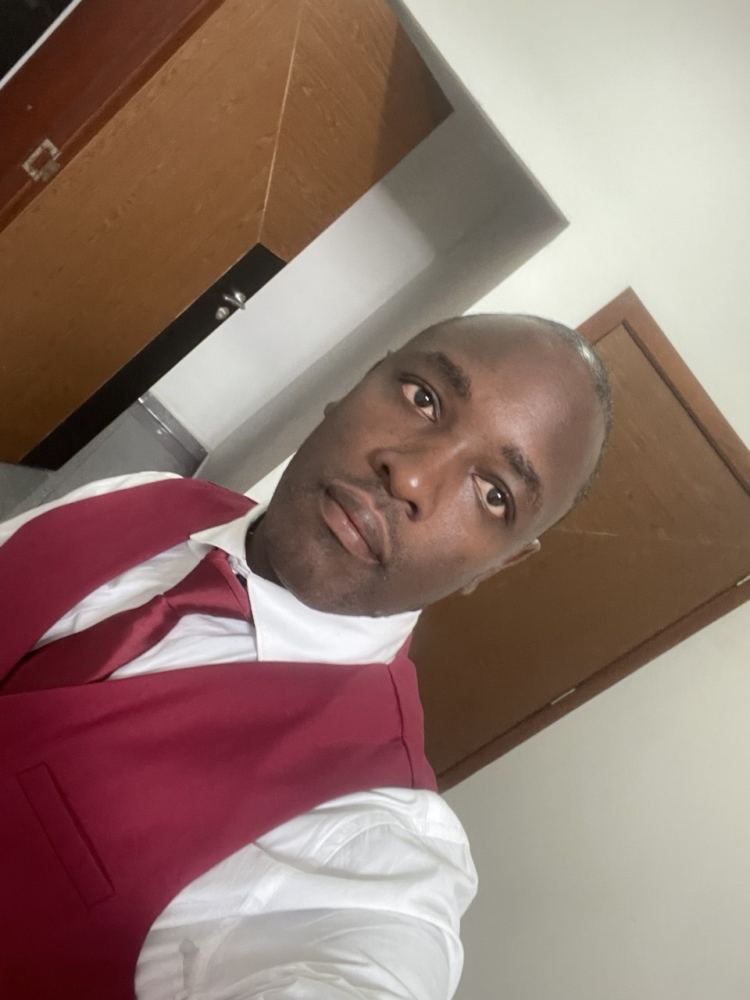

# Junior Passy Portfolio

## Présentation

Bienvenue sur le portfolio professionnel de **Junior Passy SUFFO**.

Je suis un profil hybride combinant :

- Électrotechnique et maintenance industrielle
- Développement Full Stack Web & Mobile
- Technologies IoT et systèmes embarqués

Mon objectif est de concevoir des solutions intelligentes connectant les systèmes physiques et numériques.

---

# Parcours

## Formation

- 🎓 Baccalauréat scientifique
- 🎓 BTS Electrotechnique
- 🎓 Licence professionnelle Electrotechnique
- 💻 Formation Développement Full Stack JavaScript Web & Mobile

## Évolution professionnelle

Mon parcours suit une progression :
Électrotechnique
↓
Maintenance électrique
↓
Développement développement d'application
↓
IoT et systèmes embarqués

---

# Technologies utilisées

## Frontend

- React
- TypeScript
- Tailwind CSS
- Vite
- Framer Motion

## Backend (compétences)

- Node.js
- Express.js
- API REST

## Bases de données

- MongoDB
- MySQL

## Outils

- Git
- GitHub
- Figma
- Adobe XD

---

